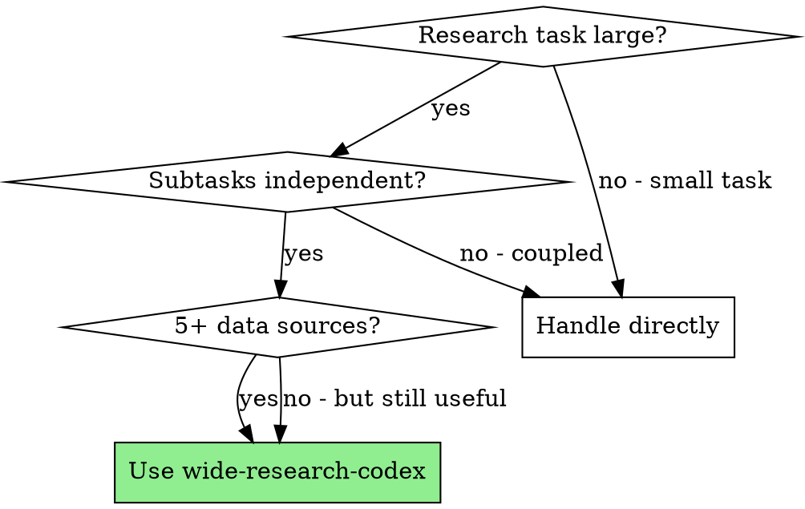

# Wide Research for Codex CLI

## Overview

Divide-and-conquer orchestration for large-scale research with Codex CLI. Break a research task into independent subtasks, spawn a separate `codex exec` child process for each (isolated context window), run in parallel, aggregate programmatically, then polish section-by-section.

**Why:** All LLMs suffer context window degradation — once output fills 20-50% of the context, quality drops (skipping, summarizing, missing items). Isolated child processes solve this.

## When to Use

**Use when:** User mentions "Wide Research", or task involves researching 5+ independent dimensions (topics, URLs, datasets, modules) that each need individual analysis before synthesis.

**Don't use when:** Task is small (1-2 items), subtasks are tightly coupled, or results depend on shared mutable state.

## Core Pattern

**Before:** Single agent attempts everything → hits context limit → starts skipping, summarizing, losing depth.

**After:** Orchestrator decomposes → parallel `codex exec` children → programmatic aggregation → section-by-section polish → deep, comprehensive report.

## Workflow (9 phases)

| Phase | Action | Owner |
|-------|--------|-------|
| 0 | Pre-run planning & reconnaissance | Orchestrator (mandatory, no delegation) |
| 1 | Initialize run directory, clarify goals | Orchestrator |
| 2 | Identify sub-goals, assign IDs | Orchestrator |
| 3 | Generate scheduler script (`run_children.sh`) | Orchestrator |
| 4 | Design child prompts with tool constraints | Orchestrator |
| 5 | Parallel execution via scheduler | Bash script |
| 6 | Programmatic aggregation (scripted, no LLM) | Aggregation script |
| 7 | Digest aggregate, design polished outline | Orchestrator |
| 8 | Section-by-section polishing | Orchestrator |
| 9 | Deliver standalone report file | Orchestrator |

## Quick Reference — Codex-Specific Settings

| Setting | Value |
|---------|-------|
| Sandbox | `--sandbox workspace-write` |
| Network | `-c sandbox_workspace_write.network_access=true` |
| Reasoning effort | `-c model_reasoning_effort="low"` (default) |
| Output | `--output-last-message "$output_file"` |
| Default timeout | 5 min (light), 15 min max |
| Default concurrency | 8 parallel workers |
| Search tool | Tavily MCP (`tavily_search`/`tavily_extract`) preferred |
| Tavily settings | `max_results=6`, `search_depth="advanced"` |

## Key Rules

- **Programmatic aggregation only** — never use LLM to merge child outputs
- **Cache first** — persist MCP results to `raw/` before processing
- **Read fully before summarizing** — no truncation by fixed length
- **Attempt twice on failure** — then write error section, never leave gaps
- **Section-by-section polish** — never wipe and rewrite entire document
- **Deliver as file** — provide path + synopsis, never paste full report in chat
- **Two-Step QA** before release: verify staged edits, gauge depth

## Common Mistakes

- Using `--model` override without user authorization
- Forgetting `--output-last-message` (child output lost)
- Enabling `--dangerously-bypass-approvals-and-sandbox` unnecessarily
- Letting orchestrator do heavy research (delegate to children)
- Aggregating via LLM instead of script (context overflow)
- Pasting final report into chat instead of saving as file

## References

- **Full English procedure:** See `./orchestration-reference-en.md` (complete 9-step workflow with all Codex-specific details)
- **Full Chinese procedure:** See `./orchestration-reference-cn.md` (中文完整流程)
- **Scheduler script template:** See `./scripts/run_children.sh`
- **Example outputs:** See `./examples/` for three complete research reports (L-mount cameras, Yage AI perspectives, Yang Zhenning biography)
- **Original project:** [grapeot/codex_wide_research](https://github.com/grapeot/codex_wide_research)
