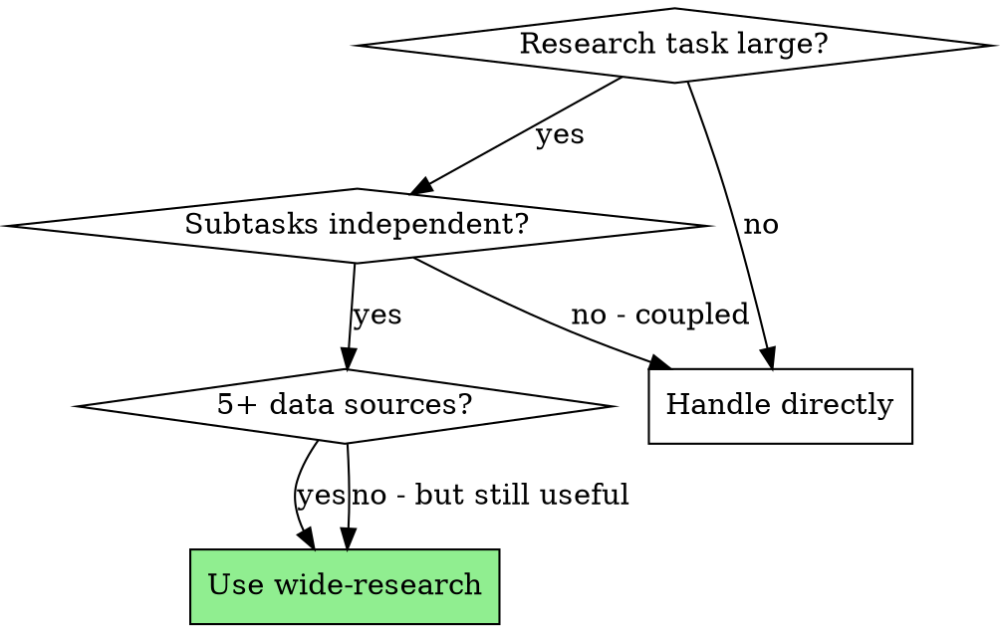

# Wide Research for Claude Code

## Overview

Divide-and-conquer orchestration for large-scale research with Claude Code. Break a research task into independent subtasks, dispatch a separate Agent for each (isolated context window), run in parallel, aggregate programmatically, then polish section-by-section.

**Why this exists:** All LLMs suffer context window degradation — once output fills 20-50% of context, quality drops (skipping items, summarizing instead of processing, missing entries). Isolated agent contexts solve this.

**Inspired by:** [grapeot/codex_wide_research](https://github.com/grapeot/codex_wide_research), adapted for Claude Code's tool system.

## When to Use

**Use when:** User mentions "Wide Research", or task involves researching 5+ independent dimensions (topics, URLs, datasets, modules) needing individual analysis before synthesis.

**Don't use when:** Task is small (1-2 items), subtasks are coupled, or results depend on shared mutable state.

## Core Pattern

**Before:** Single agent attempts everything → hits context limit → starts skipping, summarizing, losing depth.

**After:** Orchestrator decomposes → parallel Agent tool calls (each with isolated context) → programmatic aggregation → section-by-section polish → deep, comprehensive report.

## Tool Mapping (Codex → Claude Code)

| Original Codex | Claude Code Equivalent |
|----------------|----------------------|
| `codex exec` child process | Agent tool (subagent_type="general-purpose") |
| Bash scheduler (`run_children.sh`) | Concurrent Agent tool calls in single message |
| `--sandbox workspace-write` | Standard workspace file write permissions |
| `--output-last-message` | Agent returns result directly |
| `tavily_search` MCP | WebSearch tool |
| `tavily_extract` MCP | `mcp__web_reader__webReader` |
| `codex mcp list` | Check available tools in environment |
| `timeout` command | Agent calls have built-in timeouts |
| `tee logs/<id>.log` | Agent output returned directly |

## Workflow (9 phases)

| Phase | Action | Owner |
|-------|--------|-------|
| 0 | Pre-run planning & reconnaissance | You (mandatory, no delegation) |
| 1 | Initialize run directory, clarify goals | You |
| 2 | Identify sub-goals, assign IDs | You |
| 3 | Design child agent prompts | You |
| 4 | Generate prompt files from templates | You |
| 5 | Parallel dispatch via Agent tool calls | You (concurrent) |
| 6 | Programmatic aggregation (Bash/Read, no LLM) | You |
| 7 | Digest aggregate, design polished outline | You |
| 8 | Section-by-section polishing | You |
| 9 | Deliver standalone report file | You |

## Key Rules

- **Programmatic aggregation only** — concatenate child outputs via Bash/Read, never use an LLM to merge
- **Cache first** — persist fetched content to `raw/` before processing
- **Read fully before summarizing** — no truncation by fixed length
- **Attempt twice on failure** — then write error section, never leave gaps
- **Section-by-section polish** — never wipe and rewrite entire document in one pass
- **Deliver as file** — provide file path + synopsis, never paste full report in chat
- **Two-Step QA** before release: (1) verify staged edits, (2) gauge depth

## Common Mistakes

- Dispatching agents sequentially instead of in parallel (wastes time)
- Letting one agent handle multiple subtasks (context overflow)
- Aggregating via LLM synthesis instead of programmatic concatenation
- Skipping the reconnaissance phase (leads to poor decomposition)
- Pasting final report into chat instead of saving as file
- Truncating source material instead of reading fully

## References

- **Full procedure with all details:** See `./orchestration-reference.md`
- **Child agent prompt template:** See `./child-agent-prompt-template.md`
- **Codex CLI version:** See `../wide-research-codex/` for the original Codex skill
